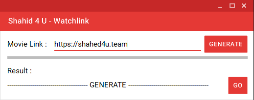

<!-- Improved compatibility of back to top link: See: https://github.com/othneildrew/Best-README-Template/pull/73 -->

<!--
*** Thanks for checking out the Best-README-Template. If you have a suggestion
*** that would make this better, please fork the repo and create a pull request
*** or simply open an issue with the tag "enhancement".
*** Don't forget to give the project a star!
*** Thanks again! Now go create something AMAZING! :D
-->

<!-- PROJECT SHIELDS -->
<!--
*** I'm using markdown "reference style" links for readability.
*** Reference links are enclosed in brackets [ ] instead of parentheses ( ).
*** See the bottom of this document for the declaration of the reference variables
*** for contributors-url, forks-url, etc. This is an optional, concise syntax you may use.
*** https://www.markdownguide.org/basic-syntax/#reference-style-links
-->

<!-- PROJECT LOGO -->
 

  

<h3 align="center">Shahed4u Watchlink</h3>

  

    get Shahed4u Direct Watchlink using movie/film link
     
    <a href="https://github.com/herooiboo/shahed4u-Watchlink/Download/Download.zip"><strong>Download EXE File »</strong></a>
     
     
    <a href="https://github.com/herooiboo/shahed4u-Watchlink">View Demo</a>
    ·
    <a href="https://github.com/herooiboo/shahed4u-Watchlink/issues">Report Bug</a>
    ·
    <a href="https://github.com/herooiboo/shahed4u-Watchlink/issues">Request Feature</a>
  

<!-- TABLE OF CONTENTS -->

  
Table of Contents

  <ol>
    <li>
      <a href="#about-the-project">About The Project</a>
      <ul>
        <li><a href="#built-with">Built With</a></li>
      </ul>
    </li>
  </ol>

<!-- ABOUT THE PROJECT -->
## About The Project

The project is based on <a href="https://shahed4u.team/" target="_blank">shahed4u</a>, Simply Disable JAVASCRIPT to turn off any ads and when you want to watch just copy the Movie link and paste it inside the app and click generate it'll get the watch url for you easialy 

(<a href="#readme-top">back to top</a>)

### Built With

* VB.NET

(<a href="#readme-top">back to top</a>)

